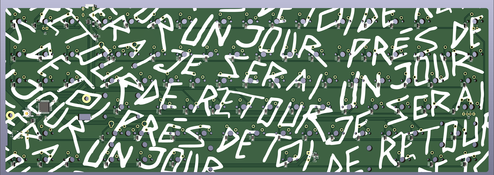

# 1.2og repro pcb

| front                           | back                          | lightbar                  |
| --------------------------------- | --------------------------- | ------------------------- |
|  |  |  |

unfinished attempt to re-create pcb and lightbar for matrix 1.2og.

this has been designed by using pcb edge cuts and plate file that were provided courtesy of astro of matrixlab [here](https://geekhack.org/index.php?topic=106122.msg2901076#msg2901076). without it, re-creating the PCB would be a more maddening and expensive experience. it has 19.02mm x 19.02mm spacing (mostly). 

indicator LEDs on scroll lock and caps lock. JST headers are for s3b ph 3 pin, since that's what it looks like from watching youtube build videos.

## warnings/differences

* The official plate file is treated as the source of truth for where switches should be placed
  * The official 1.2OG PCB edge cuts provided by astro has some arcane spacing rules -
    * 19.02mm on y axis for every row
    * 19.02mm on x axis on first three rows and all arrow keys
    * 19.00mm on row 4 on the main cluster of keys (not arrow keys)
      * The right shift key might still be at where it would be at 19.02mm spacing. The left shift key, i'm not sure, I just placed it where it would have been at 19.02mm spacing.
    * 18.978mmm on modifier keys in the bottom row (not sure if spacebar key is affected)
  * all of this is ignored in favor of sticking with plate dimensions or expected plate dimensions, which are 19.02mm x 19.02mm spacing, EXCEPT
    * 19.0224mm y-axis spacing between the function row and regular key cluster
* lightbar mounting holes on PCB are slightly off-spec, and in here are plated m3 (edge cuts seem to imply the hole is a bit wider).
* lightbar can now connected to PCB through a molex pico ezmate cable. if you don't like it, you can assemble without it, and solder the s3b connector on yourself.
* split backspace and split right shift are included, in case anyone is wants to make a plate that supports those switches. ISO left shift and enter are not included due to laziness.
* usb port placement is mostly guessing.
* there's a little reset jumper beneath the spacebar so you don't need to disassemble the thing to hit the reset button

## misc

stm32f072 schematic is courtesy of xphoenixd. thanks for teaching me how to design PCB's, man. schematic for ws2812c-2020 rgb chain is inspired by zykrah's [fuyu](https://github.com/zykrah/fuyu). voltage step-up thing for lightbar is inspired by schematic from fuyu and dededecline and olivia's [sst60](https://github.com/dededecline/SST60).

i don't know if i'm allowed to license this, given the pcb edge cuts this is based off of were released without a license.

this is completely untested.

## todo

1. ~~fill out BOM real good~~
2. measure and source standoffs that are good enough and ultra low profile screws
3. ~~split main pcb and lightbar pcb separately so jlcpcb production files don't keep bothering each other~~
4. adjust placement of ws2812 based on if it is too far to one side of the lightbar or the other.
5. consider alternative to ws2812 2020 if power consumption/cost reasons.
6. prototype PCB and lightbar
7. ~~firmware (come on, this is basically automated at this point)~~
8. modify lightbar to support both direct soldering and ezmate/jst ach through mouse bite/break off thing or something
9. verify this works with original lightbar

